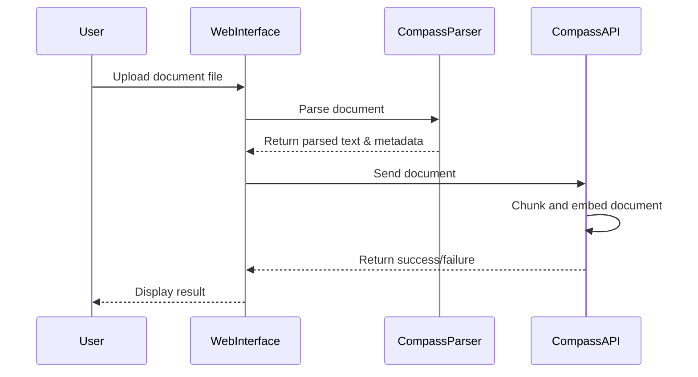
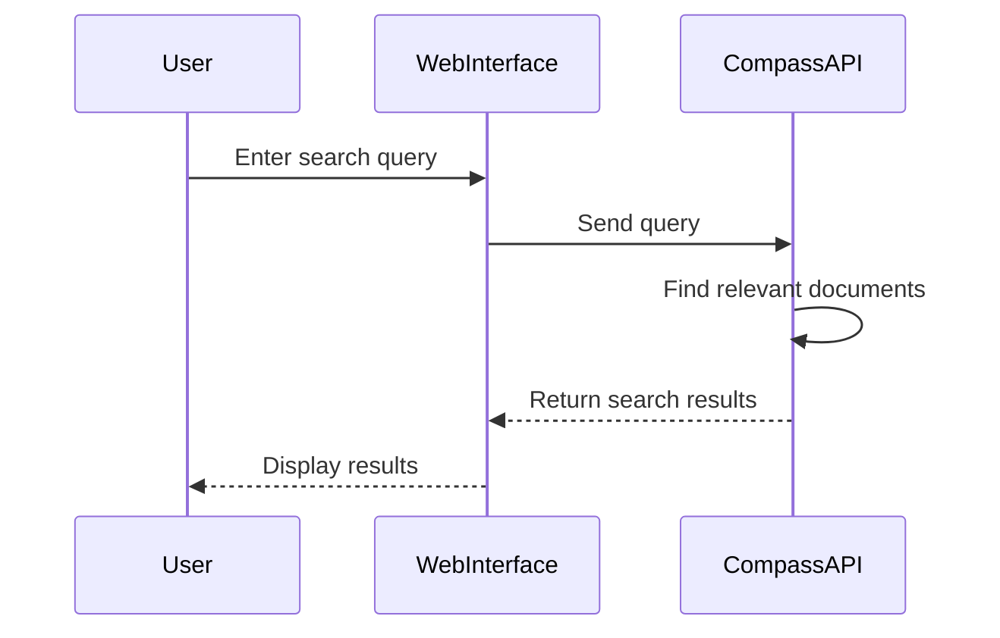
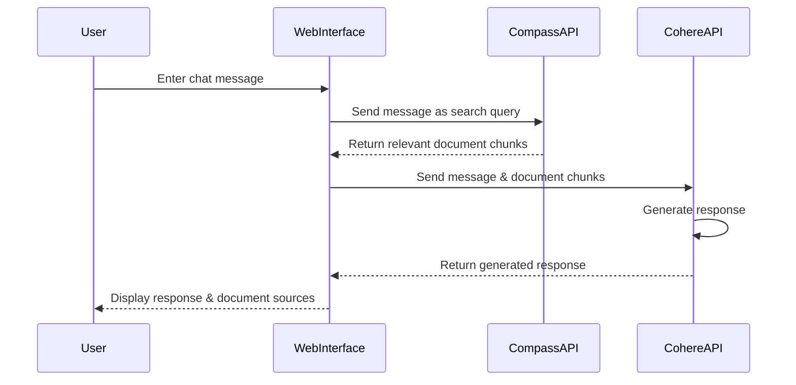

# Data Model

This document describes the data model for the Cohere Compass SDK Web Interface. The application primarily interacts with external APIs (Cohere Compass and Cohere) rather than maintaining its own database, but it does maintain some local state.

## External Data Models

### Compass Index

An index is a collection of documents that can be searched.

```json
{
  "name": "string",
  "count": "integer",
  "created_at": "datetime",
  "updated_at": "datetime"
}
```

### Compass Document

A document is a piece of text content with optional metadata.

```json
{
  "document_id": "string",
  "text": "string",
  "metadata": {
    "key1": "value1",
    "key2": "value2"
  }
}
```

### Compass Document Chunk

A document chunk is a segment of text from a document that is used for retrieval.

```json
{
  "document_id": "string",
  "chunk_id": "string",
  "text": "string",
  "metadata": {
    "key1": "value1",
    "key2": "value2"
  },
  "embedding": [0.1, 0.2, ...] // Vector representation
}
```

### Search Result

A search result representing a relevant document chunk.

```json
{
  "document_id": "string",
  "text": "string",
  "score": "float",
  "metadata": {
    "key1": "value1",
    "key2": "value2"
  }
}
```

### Chat Model

Information about a language model available for chat.

```json
{
  "id": "string",
  "name": "string",
  "description": "string",
  "max_context_length": "integer",
  "capabilities": ["string"]
}
```

## Internal Data Models

### Settings

Application settings stored locally in a pickle file.

```json
{
  "cohere_api_key": "string",
  "compass_api_bearer_token": "string",
  "compass_parser_bearer_token": "string",
  "chat_model": "string"
}
```

### Chat Message

A message in a chat conversation.

```json
{
  "role": "string", // "user", "assistant", or "system"
  "content": "string"
}
```

### Chat Session

A chat session containing messages and context.

```json
{
  "messages": [
    {
      "role": "string",
      "content": "string"
    }
  ],
  "index_name": "string",
  "model": "string"
}
```

## Data Flow

### Document Upload Flow

1. User uploads a document file
2. File is processed by the Compass Parser to extract text and metadata
3. The parsed document is sent to the Compass API
4. The Compass API splits the document into chunks
5. Each chunk is embedded and stored in the index



### Search Flow

1. User enters a search query
2. The query is sent to the Compass API
3. The Compass API finds relevant document chunks
4. Results are returned to the web interface
5. The web interface displays the results



### Chat Flow

1. User enters a chat message
2. The chat message is sent to the Compass API to find relevant document chunks
3. The relevant document chunks and chat message are sent to the Cohere API
4. The Cohere API generates a response
5. The response and the document chunks are returned to the web interface
6. The web interface displays the response and the document chunks



## Data Storage

### Local Storage

- **Settings**: Stored in a pickle file (`settings.pkl`) for persistence
- **Session Data**: Stored in Flask sessions (browser cookies)

### External Storage

- **Indexes and Documents**: Stored in the Compass service
- **Model Configurations**: Managed by the Cohere API

## Data Validation

The application performs validation of:

1. Input form data before submission
2. API responses to ensure they match expected formats
3. File types for document uploads
4. JSON data for metadata fields

## Data Security

- API keys and tokens are stored in environment variables or encrypted settings
- No user data is stored persistently in the application
- Communication with external APIs uses HTTPS
- Input validation helps prevent injection attacks

## Data Limitations

- **File Size**: Document uploads are limited to 10MB per file
- **Query Length**: Search and chat queries are limited to 1,024 tokens
- **Results**: Search results are typically limited to 10-100 items per query
- **Context Window**: Chat models have context limits (varies by model, typically 4K-32K tokens) 