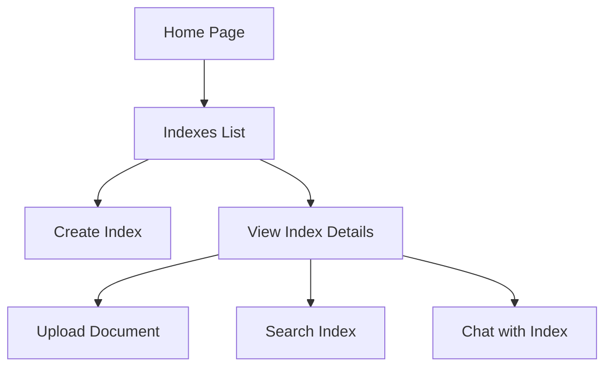
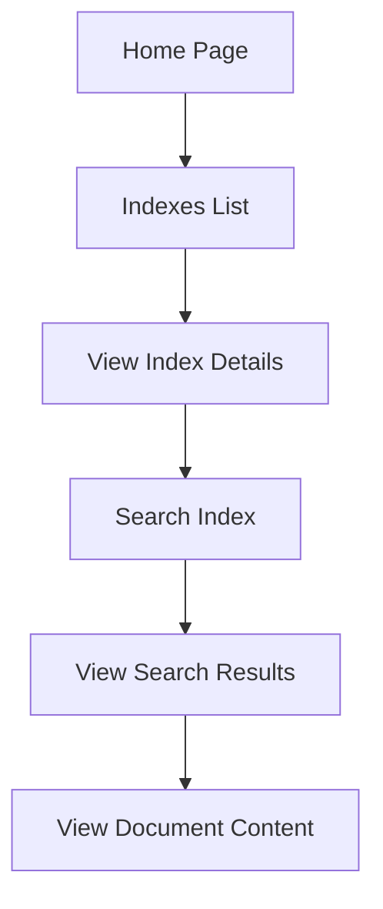
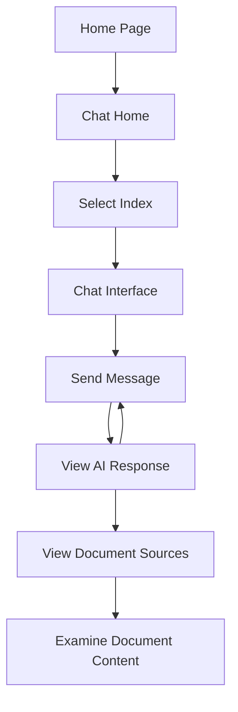
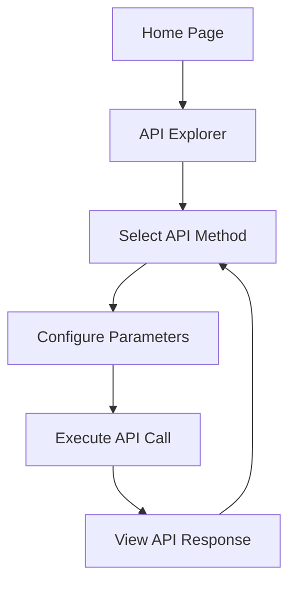
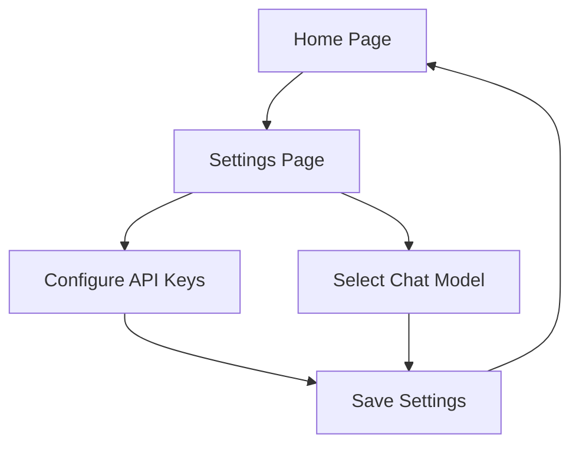

# UX Flow

This document outlines the user experience flows for the Cohere Compass SDK Web Interface. It describes how users navigate through the application and the interactions they can perform.

## User Journeys

### 1. Index Management Journey

### 2. Document Search Journey

### 3. Chat Journey

### 4. API Explorer Journey

### 5. Settings Journey

## Screen Descriptions

### Home Page

**Purpose**: Provide an entry point to the application and overview of capabilities.

**Key Elements**:
- Welcome message and brief description
- Navigation menu with links to main sections
- Quick access to recently used indexes (if any)

**User Actions**:
- Navigate to different sections
- View application status

### Indexes List

**Purpose**: Display all available indexes and allow creation of new ones.

**Key Elements**:
- List of indexes with names, document counts, and creation dates
- "Create New Index" button
- Search/filter functionality

**User Actions**:
- View index details
- Create new index
- Sort/filter indexes

### Create Index

**Purpose**: Allow users to create a new document index.

**Key Elements**:
- Form with index name field
- Advanced configuration options (collapsible)
- Submit button

**User Actions**:
- Enter index name
- Configure advanced settings
- Submit form to create index

### View Index

**Purpose**: Display details about a specific index and provide actions.

**Key Elements**:
- Index metadata (name, creation date, document count)
- Action buttons (Upload, Search, Chat)
- List of documents in the index (if available)

**User Actions**:
- Upload documents
- Search the index
- Chat with the index
- View document list

### Upload Document

**Purpose**: Allow users to upload documents to an index.

**Key Elements**:
- File upload dropzone
- Document ID field (optional)
- Metadata input (optional)
- Upload button
- Progress indicator

**User Actions**:
- Select file to upload
- Provide optional metadata
- Submit upload
- View upload progress and results

### Search Interface

**Purpose**: Enable users to search for documents in an index.

**Key Elements**:
- Search query input
- Search parameters (top_k, include_metadata)
- Search button
- Results display area

**User Actions**:
- Enter search query
- Configure search parameters
- View search results
- Click on results to see full content

### Chat Interface

**Purpose**: Allow users to chat with documents using natural language.

**Key Elements**:
- Chat message history
- Message input field
- Send button
- Search results panel showing document context
- Model selection indicator

**User Actions**:
- Type and send messages
- View AI responses
- See which documents were used as context
- Click on documents to view full content

### API Explorer

**Purpose**: Provide an interface for testing SDK API methods.

**Key Elements**:
- Method selection dropdown
- Dynamic parameter forms
- Execute button
- Response display area

**User Actions**:
- Select API method
- Configure parameters
- Execute API call
- View formatted response

### Settings Page

**Purpose**: Allow configuration of application settings.

**Key Elements**:
- API key input fields
- Chat model selection
- Save button
- Status messages

**User Actions**:
- Enter API credentials
- Select preferred chat model
- Save settings

## Interface Components

### Navigation

A consistent navigation bar appears at the top of all pages with links to:
- Home
- Indexes
- Chat
- API Explorer
- Documentation
- Settings

### Messages and Notifications

- **Success Messages**: Green notifications for successful operations
- **Error Messages**: Red notifications for errors
- **Info Messages**: Blue notifications for informational updates
- **Loading Indicators**: Spinners for operations in progress

### Forms

- **Input Validation**: Inline validation with error messages
- **Form Buttons**: Primary action buttons prominently displayed
- **Optional Fields**: Clearly marked as optional
- **Help Text**: Contextual help available for complex fields

### Chat Components

- **Message Bubbles**: Visually distinguishing user and AI messages
- **Typing Indicator**: Shows when the AI is generating a response
- **Source Citations**: Links to document sources used by the AI
- **Model Badge**: Indicator showing which model is being used

### Search Results

- **Result Cards**: Display document snippets with highlighting
- **Metadata Display**: Shows document ID and relevance score
- **Pagination**: For navigating large result sets
- **Document Preview**: Modal dialog for viewing full document content

## Responsive Design

The interface is designed to be responsive across different screen sizes:

### Desktop (> 1024px)
- Full navigation menu
- Multi-column layouts
- Side-by-side chat and search results

### Tablet (768px - 1024px)
- Condensed navigation
- Reduced column widths
- Collapsible panels

### Mobile (< 768px)
- Hamburger menu for navigation
- Single column layout
- Tabbed interface for chat/search results

## Accessibility Considerations

- **Keyboard Navigation**: All functions accessible via keyboard
- **Screen Reader Support**: Proper ARIA labels and semantic HTML
- **Color Contrast**: Meeting WCAG AA standards
- **Font Sizing**: Responsive and adjustable text sizes
- **Focus Indicators**: Clear visual indication of focused elements

## Interaction Patterns

### Chat Interaction

1. User types a message in the input field
2. User clicks "Send" or presses Enter
3. Message appears in the chat history
4. Loading indicator shows while AI generates response
5. AI response appears in the chat history
6. Document sources appear in the search results panel
7. User can click on a document to view its full content

### Search Interaction

1. User enters a search query
2. User configures search parameters (optional)
3. User clicks "Search" button
4. Loading indicator shows while search is processed
5. Results appear in the results area
6. User can click on a result to view full document
7. User can refine search and try again

### Form Submission Pattern

1. User fills in required fields
2. Validation occurs on blur or input
3. Submit button is enabled when form is valid
4. User submits form
5. Loading indicator shows during processing
6. Success/error message appears
7. On success, user is redirected or form is reset

## State Management

The application manages several types of state:

1. **Session State**: User's current session and authentication
2. **Navigation State**: Current page and history
3. **Form State**: Form values and validation status
4. **Chat State**: Message history and context
5. **Search State**: Query parameters and results
6. **Settings State**: User configuration

## Error Handling Patterns

1. **Form Validation Errors**: Displayed inline below fields
2. **API Errors**: Displayed as notifications with retry options
3. **Connection Errors**: Alert with reconnection instructions
4. **Not Found Errors**: Friendly 404 page with navigation help

## Loading States

1. **Button Loading**: Spinner replaces text on buttons during action
2. **Page Loading**: Skeleton UI while page content loads
3. **Chat Loading**: Typing indicator while generating response
4. **Search Loading**: Progress bar while searching

## Visual Design Principles

1. **Consistency**: Consistent use of colors, typography, and spacing
2. **Hierarchy**: Clear visual hierarchy to guide user attention
3. **Simplicity**: Clean, uncluttered interfaces focused on content
4. **Feedback**: Clear visual feedback for all user actions
5. **Branding**: Subtle incorporation of Cohere brand elements 